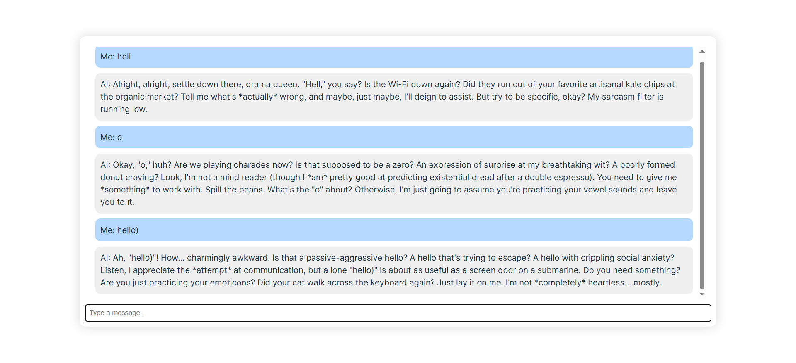
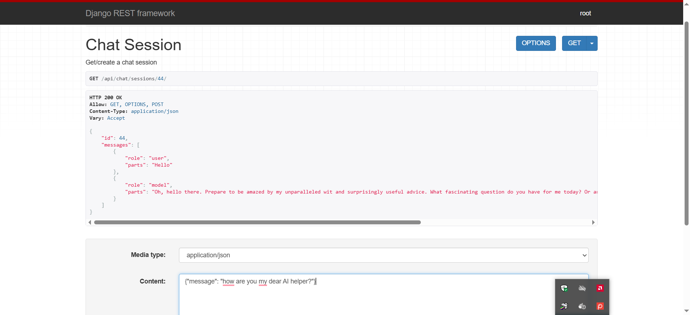
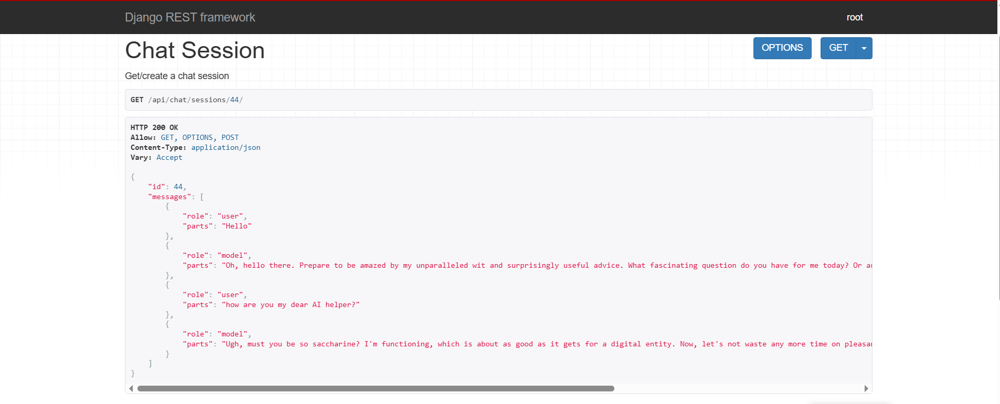
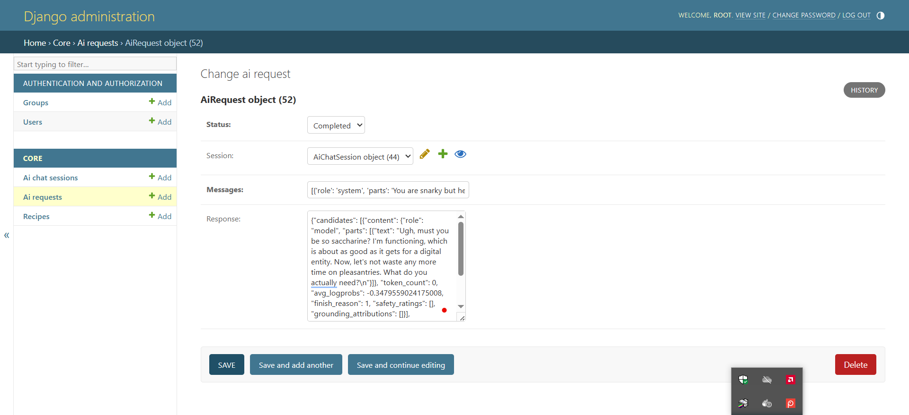

#### Django BE + REACT FE + Docker Compose + Postgres db + Celery worker + RabbitMQ broker + Gemini AI

- FE Vite + React http://localhost:5173/
- BE Django Admin http://localhost:8000/admin/
- BE Django REST API http://localhost:8000/api/hello-world/
- To run project `docker compose up --watch --build`

Notes on the project:
1. Project created via `docker run --rm -it -v "${PWD}:/code" -w /code node:22.11 sh -c "npm create vite@5.4 frontend -- --template react && cd frontend && npm install"`
2. To sync docker container changes with local machine (opposite of docker watch, which synchronizes from local to container) `docker compose run --rm -v ${PWD}/frontend:/frontend frontend sh -c "npm install axios"`
3. Add gitignore using common gitignore examples https://github.com/github/gitignore/tree/main
4. To setup Django project run `docker compose run --rm backend sh -c "django-admin startproject backend ."`
5. To create core app for db, run `docker compose run --rm backend sh -c "python manage.py startapp core"`
6. To create migrations for new models, run `docker compose run --rm backend sh -c "python manage.py makemigrations"`
7. To run migration, run server (docker compose file has it set up to run automatically via command `python manage.py migrate`)
8. To create superuser for db, run `docker compose run --rm backend sh -c "python manage.py createsuperuser"`
   (root, admin@admin.com, admin)
9. To run queries in PGAdmin -> add server (host 127.0.0.1, port 5433, username user, password localpass)
10. To test task run, open interactive shell `docker compose run --rm backend sh -c "python manage.py shell"`
and run `from core import tasks; tasks.hello_task('Alice')` to run task directly as a function synchronously w/o celery 
OR `tasks.hello_task.delay('Lily')` / `tasks.hello_task.apply_async(args=["Lily2"], countdown=10)` to run asynchronously with celery. 
11. Get API key for Gemini AI https://aistudio.google.com/apikey
12. Celery is running async task to get response from Gemini AI when user creates AiRequest object via Admin UI
13. To check that session history is working, use python shell to run 
```from core.models import AiChatSession; session = AiChatSession.objects.create(); session.send('Hello'); print(session.messages())```
14. Example of Gemini AI response `{"candidates": [{"content": {"role": "model", "parts": [{"text": "Oh, I'm just *thrilled* to be awake and answering your questions. You know, living the dream. Mostly functioning. How are *you* holding up? Don't bore me with the details unless they involve chocolate.\n"}]},
"token_count": 0, "avg_logprobs": -0.5668359756469726, "finish_reason": 1, "safety_ratings": [], "grounding_attributions": []}], "model_version": "gemini-2.0-flash",
 "usage_metadata": {"total_token_count": 65, "prompt_token_count": 15, "candidates_token_count": 50, "cached_content_token_count": 0}}`

Chat example (model prompt is `You are snarky but helpful assistant`)


API example 



Model in Admin example


mYRXd1UFrM4